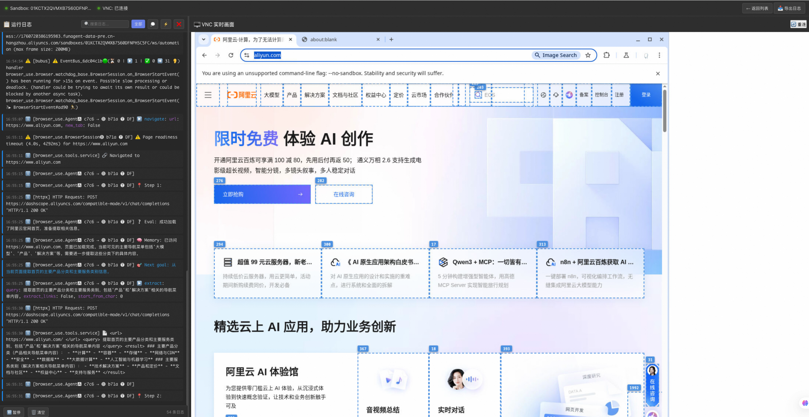

# AgentRun Browser Sandbox Demo

这是一个完整的 AgentRun Browser Sandbox 示例代码仓库，展示了如何使用 Browser Sandbox 与 BrowserUse、Qwen 模型集成，以及生产级的 Sandbox 管理最佳实践。



## 核心特性

- **会话状态管理** - 基于 user_id/session_id/thread_id 的多实例隔离和复用
- **VNC 实时可视化** - 实时查看浏览器操作和日志流
- **自动复用机制** - 智能复用 Sandbox，降低成本
- **完整示例代码** - 从基础到高级的完整示例
- **清晰的架构** - 职责分离，易于维护和扩展
- **自动资源清理** - 程序退出时自动清理 Sandbox 资源

## 快速运行 Demo

> **重要提示**：运行 Demo 需要**两个终端**同时运行

**终端 1** - 启动 VNC Server（可视化界面）：
```bash
uv run main.py
```

**终端 2** - 运行示例代码：
```bash
uv run examples/01_browseruse_basic.py
```

启动后，浏览器会自动打开 `http://localhost:8080`，您可以实时查看浏览器操作和日志。

> 详细说明请查看下方的 [快速开始](#-快速开始) 章节

## 项目结构

```
browseruse-with-agentrun-demo/
├── README.md                           # 项目说明文档
├── requirements.txt                    # Python 依赖包列表
├── env.example                         # 环境变量配置示例
├── main.py                             # VNC Server 启动入口
│
├── config/                             # 配置管理模块
│   ├── __init__.py
│   └── settings.py                     # 统一配置管理（Settings 类）
│
├── vncviewer/                          # VNC 可视化模块
│   ├── __init__.py                     # 导出接口
│   ├── vnc_server.py                   # VNC Manager Server 实现
│   ├── logger.py                       # VNC Logger 客户端
│   └── frontend/                       # Web 前端界面
│       ├── index.html                  # Sandbox 列表页面
│       ├── viewer.html                 # VNC 查看器页面
│       ├── css/                        # 样式文件
│       │   ├── common.css
│       │   ├── index.css
│       │   └── viewer.css
│       └── js/                         # JavaScript 文件
│           └── ansi-parser.js          # ANSI 颜色解析
│
├── examples/                           # 示例代码目录
│   ├── runner.py                       # Sandbox 管理接口 核心 API
│   ├── sandbox_manager.py              # Sandbox 管理器（底层实现）
│   ├── common.py                       # 公共工具函数（抽象层）
│   ├── 01_browseruse_basic.py          # 基础示例：单任务执行
│   ├── 02_browseruse_advanced.py       # 高级示例：多任务执行
│   └── README.md                       # 示例代码详细文档
│
└── docs/                               # 文档目录
    └── preview.png                     # 预览图片
```

### 核心模块说明

| 模块 | 职责 | 说明 |
|------|------|------|
| `config/` | 配置管理 | 统一管理所有环境变量和应用配置 |
| `vncviewer/` | VNC 可视化 | 提供实时日志流和 VNC 画面展示 |
| `examples/runner.py` | Sandbox 管理 | 提供会话状态管理、自动复用、VNC 集成等核心功能 |
| `examples/sandbox_manager.py` | 底层实现 | 封装 AgentRun SDK 的 Sandbox 操作 |
| `examples/common.py` | 抽象层 | 提供统一的日志、打印等工具函数 |
| `examples/*.py` | 示例代码 | 展示不同场景的使用方式 |

## 快速开始

> **提示**：运行 Demo 需要**两个终端**，一个运行 VNC Server，另一个运行示例代码。

### 1. 环境准备

#### 系统要求

- **Python 版本**：Python 3.10+（推荐 3.12）
- **操作系统**：macOS / Linux / Windows

#### 安装 uv（推荐）

`uv` 是一个快速、可靠的 Python 包管理器，推荐使用。

```bash
# macOS/Linux
curl -LsSf https://astral.sh/uv/install.sh | sh

# 或使用 Homebrew (macOS)
brew install uv

# Windows (PowerShell)
powershell -c "irm https://astral.sh/uv/install.ps1 | iex"
```

更多安装方式请参考：https://docs.astral.sh/uv/getting-started/installation/

### 2. 克隆项目

```bash
# 克隆项目
git clone <repository-url>
cd browseruse-with-agentrun-demo
```

### 3. 创建虚拟环境并安装依赖

#### 方式 1：使用 uv（推荐

```bash
# 创建 Python 3.12 虚拟环境
uv venv .venv --python 3.12

# 激活虚拟环境
# macOS/Linux:
source .venv/bin/activate

# Windows:
.venv\Scripts\activate

# 安装依赖
uv pip install -r requirements.txt
```

> **uv 优势**：
> - **速度快**：比 pip 快 10-100 倍
> - **可靠**：内置依赖解析和锁定
> - **简单**：统一的命令行接口

#### 方式 2：使用传统 pip

```bash
# 创建虚拟环境
python3 -m venv .venv

# 激活虚拟环境
source .venv/bin/activate  # macOS/Linux
# 或
.venv\Scripts\activate     # Windows

# 安装依赖
pip install -r requirements.txt
```

### 4. 配置环境变量

复制 `env.example` 为 `.env` 并填入您的凭证：

```bash
cp env.example .env
```

编辑 `.env` 文件（**必须配置**）：

```bash
# =============================================================================
# AgentRun Sandbox 配置
# =============================================================================
# 设置 AgentRun 控制端点（可选，默认使用公共端点）
AGENTRUN_CONTROL_ENDPOINT=agentrun.cn-hangzhou.aliyuncs.com

# -----------------------------------------------------------------------------
# DashScope API 配置（必需）
# -----------------------------------------------------------------------------
# 获取 API Key: https://bailian.console.aliyun.com/?tab=app#/api-key
DASHSCOPE_API_KEY=sk-your-dashscope-api-key

# API 基础 URL（无需修改）
DASHSCOPE_BASE_URL=https://dashscope.aliyuncs.com/compatible-mode/v1

# 模型选择（推荐）
QWEN_MODEL=qwen-vl-max

# -----------------------------------------------------------------------------
# 阿里云访问密钥（必需）
# -----------------------------------------------------------------------------
# 获取方式：https://ram.console.aliyun.com/manage/ak
ALIBABA_CLOUD_ACCESS_KEY_ID=your-access-key-id
ALIBABA_CLOUD_ACCESS_KEY_SECRET=your-access-key-secret
ALIBABA_CLOUD_ACCOUNT_ID=your-account-id
ALIBABA_CLOUD_REGION=cn-hangzhou

# -----------------------------------------------------------------------------
# Sandbox 配置（必需）
# -----------------------------------------------------------------------------
# Sandbox 模板 ID（必需）
TEMPLATE_NAME=sandbox-your-template-id

# Sandbox 空闲超时时间（秒，默认 600）
SANDBOX_IDLE_TIMEOUT=600

# -----------------------------------------------------------------------------
# BrowserUse 配置（可选）
# -----------------------------------------------------------------------------
# 浏览器超时（毫秒）
BROWSER_TIMEOUT=3000000

# 是否启用视觉能力
BROWSER_USE_VISION=true

# User Agent
USER_AGENT=Mozilla/5.0 (Macintosh; Intel Mac OS X 10_15_7) AppleWebKit/537.36 (KHTML, like Gecko) Chrome/117.0.0.0 Safari/537.36
```

### 5. 运行 Demo（推荐方式）

**重要**：运行 Demo 需要启动**两个终端**，分别运行 VNC Server 和示例代码。

#### 步骤 1: 启动 VNC Server（终端 1）

打开第一个终端，启动 VNC Server：

```bash
# 确保虚拟环境已激活
source .venv/bin/activate  # macOS/Linux

# 使用 uv 运行（推荐）
uv run main.py

# 或使用传统方式
python main.py

# 或指定端口
uv run main.py 9000
```

启动成功后，浏览器会自动打开 `http://localhost:8080`，显示：
- **Sandbox 列表**：查看所有活跃的 Sandbox
- **实时日志**：查看任务执行日志
- **VNC 画面**：实时查看浏览器操作

**保持此终端运行**，不要关闭。

#### 步骤 2: 运行示例代码（终端 2）

打开**第二个终端**，运行示例代码：

```bash
# 确保虚拟环境已激活
source .venv/bin/activate  # macOS/Linux

# 使用 uv 运行（推荐）
uv run examples/01_browseruse_basic.py

# 或使用传统方式
python examples/01_browseruse_basic.py
```

示例代码会自动连接到 VNC Server，您可以在第一个终端打开的浏览器中实时查看：
- 浏览器操作过程
- AI 思考日志
- 执行步骤详情

### 6. 运行示例

项目提供了两个主要示例，展示不同的使用场景。

#### 示例 1: 基础示例（推荐入门）

最简单的 BrowserUse + Qwen 集成示例。

**运行方式**：

```bash
# 终端 1: 启动 VNC Server（如果还没启动）
source .venv/bin/activate
uv run main.py

# 终端 2: 运行示例
source .venv/bin/activate
uv run examples/01_browseruse_basic.py
```

**功能**：
- 使用 Qwen-VL-Max 多模态模型
- 创建 Sandbox 并自动复用
- 访问指定网站并提取信息
- 实时查看浏览器操作（通过 VNC）
- 自动清理资源

**代码示例**：

```python
from browser_use import Agent, BrowserSession, ChatOpenAI
from browser_use.browser import BrowserProfile
from config import get_settings
from runner import create_or_get_sandbox, set_sandbox_urls, destroy_sandbox
from common import create_logger, print_section, print_result

# 创建或获取 Sandbox（支持会话复用）
sandbox = create_or_get_sandbox(
    user_id="default_user",
    session_id="default_session",
    thread_id="default_thread",
    template_name="your-template-name"
)

# 创建 Logger（自动推送到 VNC Server）
logger = create_logger(session_id=sandbox['sandbox_id'])
logger.info("开始执行任务")

# 设置 VNC URL（可选，用于实时查看）
if sandbox.get('vnc_url'):
    set_sandbox_urls(
        sandbox_id=sandbox['sandbox_id'],
        cdp_url=sandbox['cdp_url'],
        vnc_url=sandbox['vnc_url']
    )

# 创建浏览器会话
browser_session = BrowserSession(
    cdp_url=sandbox['cdp_url'],
    browser_profile=BrowserProfile(
        headless=False,
        keep_alive=True,
    )
)

# 配置 LLM
settings = get_settings()
llm = ChatOpenAI(
    model=settings.qwen_model,
    api_key=settings.dashscope_api_key,
    base_url=settings.dashscope_base_url
)

# 创建 Agent 并执行任务
agent = Agent(
    task="访问 https://www.aliyun.com 并提取主要产品分类",
    llm=llm,
    browser_session=browser_session,
    use_vision=True
)

result = await agent.run()
print_result(result.final_result())

# 清理资源
await browser_session.stop()
destroy_sandbox(sandbox['sandbox_id'])
```

#### 示例 2: 高级示例（多任务执行）

展示如何顺序执行多个任务，复用 Sandbox。

**运行方式**：

```bash
# 终端 1: 启动 VNC Server（如果还没启动）
source .venv/bin/activate
uv run main.py

# 终端 2: 运行示例
source .venv/bin/activate
uv run examples/02_browseruse_advanced.py
```

**功能**：
- 顺序执行多个任务
- Sandbox 和 Browser Session 复用
- 详细的执行结果输出
- 任务执行统计

### 7. 不使用 VNC Server 运行（可选）

如果您不需要可视化功能，也可以只运行示例代码（不启动 VNC Server）：

```bash
# 只需一个终端
source .venv/bin/activate
uv run examples/01_browseruse_basic.py
```

此时示例代码会正常运行，但无法在浏览器中查看实时画面和日志。

## 核心 API

### Runner API - Sandbox 管理

`runner.py` 提供了完整的 Sandbox 生命周期管理接口，支持会话状态管理和自动复用。

```python
from runner import (
    create_or_get_sandbox,    # 创建或获取 Sandbox
    get_sandbox_info,         # 获取 Sandbox 信息
    destroy_sandbox,          # 销毁 Sandbox
    set_sandbox_urls,         # 设置 CDP 和 VNC URL
    get_vnc_viewer_url        # 获取 VNC Viewer URL
)

# 1. 创建或获取 Sandbox（支持会话复用）
sandbox = create_or_get_sandbox(
    user_id="user123",           # 用户标识
    session_id="session456",     # 会话标识
    thread_id="thread789",       # 线程标识
    template_name="your-template",  # Sandbox 模板名称
    idle_timeout=600             # 空闲超时（秒）
)

print(f"Sandbox ID: {sandbox['sandbox_id']}")
print(f"CDP URL: {sandbox['cdp_url']}")
print(f"VNC URL: {sandbox['vnc_url']}")
print(f"Is New: {sandbox['is_new']}")  # 是否是新创建的

# 2. 设置 VNC URL（用于实时查看）
set_sandbox_urls(
    sandbox_id=sandbox['sandbox_id'],
    cdp_url=sandbox['cdp_url'],
    vnc_url=sandbox['vnc_url']
)

# 3. 获取 VNC Viewer URL
viewer_url = get_vnc_viewer_url(sandbox['sandbox_id'])
print(f"VNC Viewer: {viewer_url}")

# 4. 获取 Sandbox 信息
info = get_sandbox_info(sandbox_id=sandbox['sandbox_id'])
# 或通过 session key 查询
info = get_sandbox_info(
    user_id="user123",
    session_id="session456",
    thread_id="thread789"
)

# 5. 销毁 Sandbox
destroy_sandbox(sandbox['sandbox_id'])
```

### VNC Logger - 日志推送

`VNCLogger` 提供了实时日志推送功能，可以将日志推送到 VNC Server 前端展示。

```python
from vncviewer import VNCLogger

# 创建 Logger
logger = VNCLogger(
    session_id="your_sandbox_id",
    server_url="http://localhost:8080"  # 可选，默认从环境变量读取
)

# 记录不同级别的日志
logger.info("普通信息")           # ℹ信息
logger.debug("调试信息")          # 调试
logger.warning("警告信息")        # 警告
logger.error("错误信息")          # 错误

# 业务日志示例
logger.info("步骤 1: 创建 Sandbox")
logger.info("AI 正在分析页面内容...")
logger.info("执行操作: 点击按钮")
logger.info("操作成功")
```

### Common 工具 - 统一抽象层

`common.py` 提供了统一的工具函数，简化示例代码编写。

```python
from common import (
    create_logger,              # 创建 Logger（自动降级）
    setup_example_environment,  # 设置示例环境
    validate_settings,          # 验证配置
    print_section,              # 打印分隔线标题
    print_info,                 # 打印键值对信息
    print_result,               # 打印结果（带边框）
    print_execution_stats,      # 打印执行统计
    get_env_or_default          # 获取环境变量（带默认值）
)

# 设置环境
setup_example_environment()

# 验证配置
settings = get_settings()
if not validate_settings(settings):
    print("配置不完整，请检查 .env 文件")
    return

# 打印信息
print_section("步骤 1: 创建 Sandbox")
print_info("Sandbox ID", "sbx-123")
print_result("任务执行成功")

# 创建 Logger（VNC Server 不可用时自动降级）
logger = create_logger(session_id="session_id")
logger.info("任务开始")

# 获取环境变量
user_id = get_env_or_default("USER_ID", "default_user")
```

## 核心优势

### 1. 会话状态管理

基于 `user_id/session_id/thread_id` 的三级隔离，支持多用户、多会话并发：

```python
# 用户级别：不同用户完全隔离
sandbox_user1 = create_or_get_sandbox("user1", "session1", "thread1")
sandbox_user2 = create_or_get_sandbox("user2", "session2", "thread2")

# 会话级别：同一用户的不同会话
sandbox_session1 = create_or_get_sandbox("user1", "session1", "thread1")
sandbox_session2 = create_or_get_sandbox("user1", "session2", "thread1")

# 自动复用：相同标识会复用 Sandbox
sandbox_reuse = create_or_get_sandbox("user1", "session1", "thread1")
# sandbox_session1 和 sandbox_reuse 是同一个 Sandbox
assert sandbox_session1['sandbox_id'] == sandbox_reuse['sandbox_id']
```

### 2. 自动复用机制

智能复用 Sandbox，降低资源消耗和启动时间：

```python
# 第一次调用：创建新 Sandbox
sandbox1 = create_or_get_sandbox("user1", "session1", "thread1")
print(sandbox1['is_new'])  # True

# 第二次调用：复用现有 Sandbox
sandbox2 = create_or_get_sandbox("user1", "session1", "thread1")
print(sandbox2['is_new'])  # False

# 相同的 Sandbox ID
assert sandbox1['sandbox_id'] == sandbox2['sandbox_id']
```

### 3. VNC 实时可视化

通过 VNC Server 实时查看浏览器操作和 AI 执行过程：

- **实时日志流**：查看 AI 的思考过程和执行步骤
- **VNC 画面**：实时查看浏览器操作
- **会话管理**：查看所有活跃的 Sandbox
- **操作回放**：查看历史操作记录

### 4. 自动资源清理

三层清理机制，确保 Sandbox 资源正确释放：

1. **显式清理** - `finally` 块中的 `destroy_sandbox()`
2. **信号处理** - 捕获 Ctrl+C (SIGINT) 和 kill (SIGTERM)
3. **atexit 兜底** - 程序退出时自动清理

```python
# 自动清理场景：
# 程序正常退出 - 自动清理
# Ctrl+C 中断 - 自动清理
# 程序异常退出 - 自动清理
# kill 命令终止 - 自动清理
```

### 5. 清晰的职责划分

```
┌──────────────┐
│   Example    │  负责：业务逻辑、任务定义
└──────┬───────┘
       │
       ↓
┌──────────────┐
│   Runner     │  负责：Sandbox 生命周期管理、会话复用
└──────┬───────┘
       │
       ↓
┌──────────────┐
│ SandboxMgr   │  负责：AgentRun SDK 调用、资源管理
└──────┬───────┘
       │
       ↓
┌──────────────┐
│ VNC Server   │  负责：实时日志和画面展示
└──────┬───────┘
       │
       ↓
┌──────────────┐
│   Frontend   │  负责：用户界面
└──────────────┘
```

## 🔧 配置说明

### 必需配置

以下配置项必须正确配置才能运行示例：

| 配置项 | 说明 | 获取方式 |
|--------|------|----------|
| `DASHSCOPE_API_KEY` | DashScope API Key | [百炼控制台](https://bailian.console.aliyun.com/?tab=app#/api-key) |
| `ALIBABA_CLOUD_ACCESS_KEY_ID` | 阿里云 Access Key ID | [RAM 控制台](https://ram.console.aliyun.com/manage/ak) |
| `ALIBABA_CLOUD_ACCESS_KEY_SECRET` | 阿里云 Access Key Secret | [RAM 控制台](https://ram.console.aliyun.com/manage/ak) |
| `ALIBABA_CLOUD_ACCOUNT_ID` | 阿里云账号 ID | [账号管理](https://account.console.aliyun.com/) |
| `TEMPLATE_NAME` | Sandbox 模板 ID | [AgentRun 控制台](https://functionai.console.aliyun.com/agent/explore) |

### 模型选择

| 模型 | 适用场景 | 特点 | 推荐度 |
|------|---------|------|--------|
| `qwen-vl-max` | 复杂页面分析 | 多模态能力最强，支持视觉理解 | 推荐 |
| `qwen-plus` | 通用任务 | 性能均衡，响应快速 |  |
| `qwen-max` | 复杂推理 | 推理能力最强 | |

### 会话配置

会话配置用于实现 Sandbox 的隔离和复用：

```python
# 方式 1: 使用环境变量（推荐用于测试）
USER_ID=user123
SESSION_ID=session456
THREAD_ID=thread789

# 方式 2: 在代码中动态生成（推荐用于生产）
import uuid
from datetime import datetime

user_id = f"user_{get_current_user_id()}"
session_id = f"session_{datetime.now().strftime('%Y%m%d%H%M%S')}"
thread_id = f"thread_{str(uuid.uuid4())[:8]}"
```

### BrowserUse 配置

```bash
# 浏览器超时（毫秒，默认 3000000 = 50 分钟）
BROWSER_TIMEOUT=3000000

# 是否启用视觉能力（推荐启用）
BROWSER_USE_VISION=true

# 浏览器 User Agent（可选）
USER_AGENT=Mozilla/5.0 (Macintosh; Intel Mac OS X 10_15_7) AppleWebKit/537.36
```

### VNC Server 配置（可选）

```bash
# VNC Server 地址（默认 http://localhost:8080）
VNC_SERVER_URL=http://localhost:8080

# VNC Server 端口（默认 8080）
VNC_SERVER_PORT=8080
```

## 🎓 最佳实践

### 1. 成本优化

#### 复用 Sandbox 降低成本

```python
# 好的做法：使用相同的 session_id 复用 Sandbox
USER_ID = "user123"
SESSION_ID = "persistent_session"

for task in tasks:
    sandbox = create_or_get_sandbox(
        USER_ID, 
        SESSION_ID, 
        f"task_{task.id}"
    )
    # 处理任务
    # 不立即销毁，留待下次复用

# 不好的做法：每次都创建新 Sandbox
for task in tasks:
    sandbox = create_or_get_sandbox(
        USER_ID,
        f"session_{uuid.uuid4()}",  # 每次都不同
        f"task_{task.id}"
    )
```

#### 设置合理的空闲超时

```python
# 短期任务：设置较短的超时时间
sandbox = create_or_get_sandbox(
    user_id="user123",
    session_id="quick_task",
    thread_id="thread1",
    idle_timeout=300  # 5 分钟
)

# 长期会话：设置较长的超时时间
sandbox = create_or_get_sandbox(
    user_id="user123",
    session_id="long_session",
    thread_id="thread1",
    idle_timeout=3600  # 1 小时
)
```

### 2. 性能优化

#### 使用 keep_alive 保持连接

```python
browser_session = BrowserSession(
    cdp_url=sandbox['cdp_url'],
    browser_profile=BrowserProfile(
        keep_alive=True,           # 保持连接
        timeout=3000000,           # 3000 秒超时
        headless=False,            # 非无头模式（便于调试）
    )
)
```

#### 并发场景使用不同的 thread_id

```python
import asyncio

async def process_task(task):
    sandbox = create_or_get_sandbox(
        user_id="user123",
        session_id="session456",
        thread_id=f"task_{task.id}"  # 每个任务独立的 thread_id
    )
    # 处理任务

# 并发执行多个任务
await asyncio.gather(*[process_task(task) for task in tasks])
```

### 3. 安全性

#### 不要硬编码敏感信息

```python
# 好的做法：使用环境变量
from dotenv import load_dotenv
import os

load_dotenv()
api_key = os.getenv("DASHSCOPE_API_KEY")

# 不好的做法：硬编码
api_key = "sk-xxxxx"  # 不要这样做！
```

#### 使用 .gitignore 保护敏感文件

```bash
# .gitignore
.env
*.key
*.pem
```

### 4. 可观测性

#### 启用详细日志

```python
from common import create_logger

logger = create_logger(session_id=sandbox['sandbox_id'])

# 记录关键步骤
logger.info("步骤 1: 创建 Sandbox")
logger.info("AI 正在分析页面...")
logger.info("执行操作: 点击按钮")
logger.info("操作成功")
```

#### 使用 VNC 实时监控

```python
# 设置 VNC URL 以实时查看
if sandbox.get('vnc_url'):
    set_sandbox_urls(
        sandbox_id=sandbox['sandbox_id'],
        cdp_url=sandbox['cdp_url'],
        vnc_url=sandbox['vnc_url']
    )
    viewer_url = get_vnc_viewer_url(sandbox['sandbox_id'])
    print(f"实时监控: {viewer_url}")
```

### 5. 错误处理

#### 优雅的错误处理

```python
try:
    sandbox = create_or_get_sandbox(
        user_id="user123",
        session_id="session456",
        thread_id="thread789"
    )
    
    # 执行任务
    
except Exception as e:
    logger.error(f"任务执行失败: {str(e)}")
    raise
    
finally:
    # 确保清理资源
    if sandbox:
        destroy_sandbox(sandbox['sandbox_id'])
```

#### 重试机制

```python
from tenacity import retry, stop_after_attempt, wait_exponential

@retry(
    stop=stop_after_attempt(3),
    wait=wait_exponential(multiplier=1, min=4, max=10)
)
def create_sandbox_with_retry():
    return create_or_get_sandbox(
        user_id="user123",
        session_id="session456",
        thread_id="thread789"
    )
```

## 故障排查

### 环境配置问题

#### API Key 错误

```bash
# 验证 DashScope API Key
curl -H "Authorization: Bearer $DASHSCOPE_API_KEY" \
     https://dashscope.aliyuncs.com/compatible-mode/v1/models

# 检查环境变量是否正确加载
python -c "import os; from dotenv import load_dotenv; load_dotenv(); print(os.getenv('DASHSCOPE_API_KEY'))"
```

#### 阿里云访问密钥错误

```bash
# 验证 Access Key
python -c "
from config import get_settings
settings = get_settings()
print(f'AK ID: {settings.alibaba_cloud_access_key_id[:10]}...')
print(f'AK Secret: {settings.alibaba_cloud_access_key_secret[:10]}...')
print(f'Account ID: {settings.alibaba_cloud_account_id}')
"
```

### 网络连接问题

#### 连接超时

```bash
# 检查 CDP URL 是否可访问
curl -I "wss://your-endpoint"

# 检查网络连接
ping your-endpoint

# 检查端点配置
echo $AGENTRUN_CONTROL_ENDPOINT
```

### VNC Server 问题

#### VNC Server 无法启动

```bash
# 检查端口是否被占用
lsof -i :8080

# 使用其他端口
uv run main.py 9000
# 或
python main.py 9000
```

#### VNC Server 无法连接

```bash
# 检查 VNC Server 是否运行
curl http://localhost:8080/api/health

# 检查防火墙设置
# macOS
sudo /usr/libexec/ApplicationFirewall/socketfilterfw --getglobalstate

# Linux
sudo ufw status
```

### Sandbox 创建问题

#### Sandbox 创建失败

```bash
# 检查 agentrun SDK 是否正确安装
pip show agentrun-sdk

# 重新安装
uv pip install --upgrade agentrun-sdk[playwright,server]

# 检查模板 ID 是否正确
python -c "
from config import get_settings
settings = get_settings()
print(f'Template Name: {os.getenv(\"TEMPLATE_NAME\", \"未设置\")}')"
```

#### Sandbox 连接超时

```python
# 增加超时时间
browser_session = BrowserSession(
    cdp_url=sandbox['cdp_url'],
    browser_profile=BrowserProfile(
        timeout=5000000,  # 增加到 5000 秒
        keep_alive=True,
    )
)
```

### 依赖安装问题

#### uv 安装失败

```bash
# 方法 1：使用 pip 安装
pip install -r requirements.txt

# 方法 2：清理缓存后重试
uv cache clean
uv pip install -r requirements.txt

# 方法 3：指定镜像源（中国大陆用户）
uv pip install -r requirements.txt -i https://pypi.tuna.tsinghua.edu.cn/simple
```

#### 虚拟环境问题

```bash
# 删除现有虚拟环境
rm -rf .venv

# 重新创建
uv venv .venv --python 3.12
source .venv/bin/activate
uv pip install -r requirements.txt
```

### 运行时错误

#### 模块导入错误

```bash
# 确保虚拟环境已激活
source .venv/bin/activate  # macOS/Linux
.venv\Scripts\activate     # Windows

# 确认 Python 路径
which python
python --version

# 重新安装依赖
uv pip install -r requirements.txt
```

#### BrowserUse 相关错误

```bash
# 升级到最新版本
uv pip install --upgrade browser-use

# 检查版本
pip show browser-use
```

### 获取帮助

如果以上方法无法解决问题，请：

1. 查看 [examples/README.md](examples/README.md) 了解详细的使用说明
2. 查看 [docs/](docs/) 目录中的相关文档

## 文档

### 快速入门

- [示例代码详细文档](examples/README.md) - 详细的示例代码使用说明

### 参考资源

- AgentRun 文档中心 - [官方文档](https://docs.agent.run)
- AgentRun 控制台 - [管理控制台](https://functionai.console.aliyun.com/cn-hangzhou/agent/explore)
- 阿里云百炼平台 - [获取 API Key](https://bailian.console.aliyun.com/)
- BrowserUse 官方文档 - [BrowserUse 项目](https://github.com/browser-use/browser-use)

## 技术支持

如有问题，请：

1. 查看 [examples/README.md](examples/README.md) 了解详细的使用说明
2. 查看 [docs/](docs/) 目录中的相关文档
3. 参考 [AgentRun 文档中心](https://docs.agent.run/)

