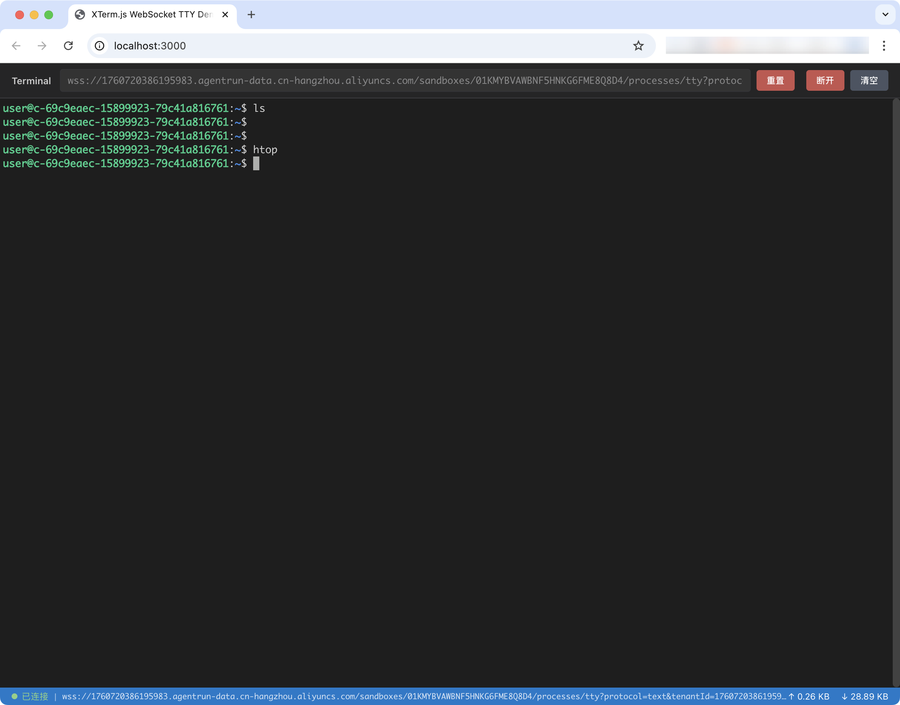

# XTerm.js WebSocket TTY 集成演示

这是一个独立的 React 项目，演示如何将 xterm.js 与 WebSocket TTY 终端进行集成。



## 项目简介

本项目展示了如何使用 xterm.js 库通过 WebSocket 连接到远程 TTY 终端,实现一个功能完整的 Web 终端模拟器。

### 主要特性

- ✅ 基于 React 18 + TypeScript
- ✅ 使用 xterm.js 作为终端模拟器
- ✅ WebSocket 实时双向通信
- ✅ 终端自适应窗口大小
- ✅ 连接状态监控
- ✅ 数据传输统计
- ✅ 优雅的错误处理

## 技术栈

- **React 18**: 前端框架
- **TypeScript**: 类型安全
- **Vite**: 构建工具
- **xterm.js**: 终端模拟器核心库
- **xterm-addon-attach**: WebSocket 连接插件
- **xterm-addon-fit**: 终端自适应插件

## 快速开始

### 前置要求

- Node.js >= 16
- npm 或 yarn

### 安装依赖

```bash
cd demo
npm install
```

### 启动开发服务器

```bash
npm run dev
```

应用将在 `http://localhost:3000` 启动。

### 构建生产版本

```bash
npm run build
```

构建产物将输出到 `dist` 目录。

### 预览生产构建

```bash
npm run preview
```

## 使用说明

### 1. WebSocket URL 格式

WebSocket TTY 终端的 URL 格式如下:

```
wss://{userId}.{domain}/sandboxes/{sandboxId}/processes/tty?protocol=text&tenantId={tenantId}
```

参数说明:
- `userId`: 用户 ID
- `domain`: 服务域名
- `sandboxId`: 沙箱实例 ID
- `tenantId`: 租户 ID
- `protocol=text`: 协议类型,使用文本协议

### 2. 连接流程

1. 在输入框中输入完整的 WebSocket URL
2. 点击"连接"按钮初始化终端
3. 在终端面板中点击"连接终端"按钮建立 WebSocket 连接
4. 连接成功后,即可在终端中执行命令

### 3. 功能说明

#### 终端工具栏
- **连接状态指示器**: 绿点表示已连接
- **连接/断开按钮**: 控制 WebSocket 连接
- **清空按钮**: 清空终端显示内容

#### 底部状态栏
显示实时统计信息:
- 发送的消息数和字节数
- 接收的消息数和字节数

## 项目结构

```
demo/
├── src/
│   ├── components/
│   │   └── Terminal.tsx        # 终端组件
│   ├── App.tsx                  # 主应用组件
│   ├── App.css                  # 样式文件
│   └── main.tsx                 # 入口文件
├── public/
│   └── index.html               # HTML 模板
├── index.html                   # Vite HTML 入口
├── package.json                 # 依赖配置
├── tsconfig.json                # TypeScript 配置
├── vite.config.ts               # Vite 配置
└── README.md                    # 项目文档
```

## 核心实现

### Terminal 组件

`Terminal.tsx` 是核心组件,负责:

1. **初始化终端实例**
   - 创建 xterm.js Terminal 实例
   - 配置终端主题和字体
   - 加载 FitAddon 实现自适应

2. **WebSocket 连接管理**
   - 建立 WebSocket 连接
   - 使用 AttachAddon 绑定 WebSocket 到终端
   - 处理连接状态变化
   - 优雅处理断线重连

3. **事件处理**
   - 窗口大小调整时自动适配终端
   - 监听用户输入并发送到服务器
   - 接收服务器响应并显示在终端

4. **资源清理**
   - 组件卸载时清理 WebSocket 连接
   - 释放终端实例和插件资源

### 关键代码片段

#### WebSocket 连接

```typescript
const ws = new WebSocket(wsUrl);

ws.onopen = () => {
  const attachAddon = new AttachAddon(ws);
  terminalInstanceRef.current.loadAddon(attachAddon);
  terminalInstanceRef.current.focus();
};

ws.onmessage = (event) => {
  // AttachAddon 自动处理消息显示
};

ws.onerror = (error) => {
  console.error('WebSocket 错误:', error);
};

ws.onclose = () => {
  // 清理连接资源
};
```

#### 终端初始化

```typescript
const terminal = new Terminal({
  cursorBlink: true,
  fontSize: 14,
  fontFamily: 'Monaco, Menlo, monospace',
  theme: { /* 自定义主题 */ }
});

terminal.open(containerElement);

const fitAddon = new FitAddon();
terminal.loadAddon(fitAddon);
fitAddon.fit();
```

## WebSocket 协议说明

### 连接参数

- `protocol=text`: 使用文本协议进行通信
- `tenantId`: 租户隔离标识
- 可选参数 `Authorization`: 访问令牌

### 数据传输

- **客户端 → 服务器**: 用户在终端中的输入
- **服务器 → 客户端**: 命令执行结果和终端输出

### 连接生命周期

1. **建立连接**: WebSocket 握手成功
2. **数据交互**: 双向实时通信
3. **关闭连接**: 
   - 正常关闭 (code 1000)
   - 异常断开 (其他错误码)

## 自定义配置

### 终端主题

修改 `Terminal.tsx` 中的 `theme` 配置:

```typescript
theme: {
  background: '#1e1e1e',
  foreground: '#d4d4d4',
  cursor: '#aeafad',
  // ... 更多颜色配置
}
```

### 终端字体

```typescript
fontSize: 14,
fontFamily: 'Monaco, Menlo, "Ubuntu Mono", Consolas, monospace'
```

### 窗口尺寸

修改 `.terminal-panel` 的 CSS:

```css
.terminal-panel {
  height: 600px; /* 调整高度 */
}
```

## 常见问题

### 1. WebSocket 连接失败

检查:
- URL 格式是否正确
- 网络是否可达
- 服务器是否支持 WebSocket
- 跨域配置是否正确

### 2. 终端显示乱码

确保:
- WebSocket 使用 `protocol=text` 参数
- 服务器返回 UTF-8 编码的文本

### 3. 终端大小不匹配

- 确保 FitAddon 已正确加载
- 检查容器元素是否有固定尺寸
- 窗口大小改变时会自动调整

## 扩展功能

### 添加认证

在 WebSocket URL 中添加认证参数:

```typescript
const wsUrl = `${baseUrl}?protocol=text&tenantId=${tenantId}&Authorization=${token}`;
```

### 添加重连机制

```typescript
const reconnect = () => {
  setTimeout(() => {
    if (!isConnected) {
      connectTerminal();
    }
  }, 3000);
};

ws.onclose = () => {
  setIsConnected(false);
  reconnect();
};
```

### 命令历史记录

使用 `onData` 监听用户输入,保存命令历史:

```typescript
const commandHistory: string[] = [];

terminal.onData((data) => {
  if (data === '\r') {
    // 回车键,保存当前命令
    commandHistory.push(currentCommand);
  }
});
```

## 参考资料

- [xterm.js 官方文档](https://xtermjs.org/)
- [xterm-addon-attach](https://github.com/xtermjs/xterm.js/tree/master/addons/xterm-addon-attach)
- [xterm-addon-fit](https://github.com/xtermjs/xterm.js/tree/master/addons/xterm-addon-fit)
- [WebSocket API](https://developer.mozilla.org/en-US/docs/Web/API/WebSocket)

## 许可证

MIT

## 贡献

欢迎提交 Issue 和 Pull Request!
